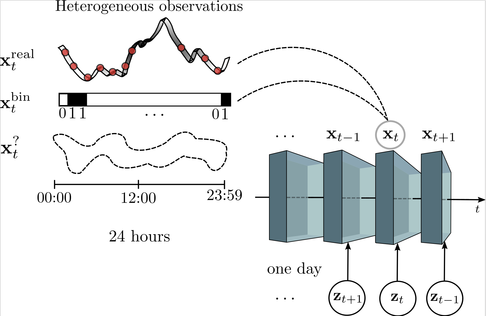

# Hierarchical Change-Point Detection

This repository contains the implementation of our Hierarchical Change-Point Detection (HierCPD) model. The entire code is written in Python and connected with the GPy package, specially useful for Gaussian processes. Our code consists of two main blocks:

# Heterogeneous Circadian Mixture Models

