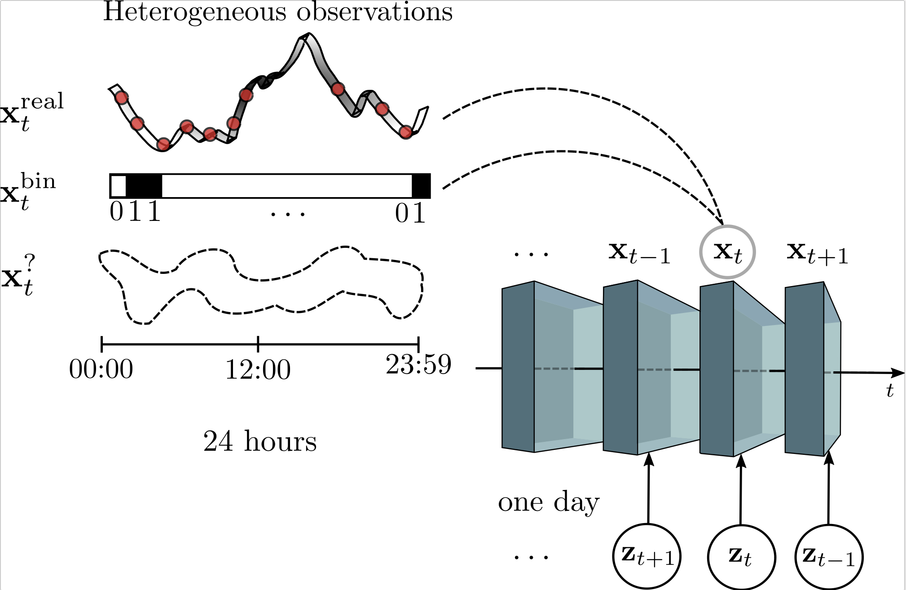

# Hierarchical Change-Point Detection

This repository contains the implementation of our Hierarchical Change-Point Detection (HierCPD) model that is fully written in Python. This model addresses the problem of change-point detection on sequences of **high-dimensional** and **heterogeneous** observations (i.e. different statistical data types) with an unknown temporal structure.

Please, if you use this code, cite the following [paper](https://arxiv.org/abs/1809.04197):
```
@article{MorenoRamirezArtes18,
  title={Change-Point Detection on Hierarchical Circadian Models},
  author={Pablo Moreno-Mu\~noz, David Ram\'irez and Antonio Art\'es-Rodr\'iguez},
  journal={arXiv preprint arXiv:1809.04197},
  year={2018}
}
```

The repository is divided in two sections that correspond to the two principal contributions of our work: **(i) Hierarchical Detector** and **(ii) Heterogeneous Circadian Mixture Models**.

# Hierarchical Detector
This is a novel probabilistic extension of the widely known Bayesian Online Change-Point Detection (BOCPD) algorithm. We extend the BOCPD method to handle any type of latent variable model. In particular, it is able to detect by directly modeling complex observations from their latent representation embedded in a lower dimensional manifold. You may find a notebook demo of the detector performance within a latent class model.

**Graphical model:** Representation of the hierarchical change-point detector. The detection is performed exclusively on the blue region. Additionally, the green region corresponds to the embedded circadian model (see below).


# Heterogeneous Circadian Mixture Models

We are to embed different types of heterogeneous models into the hierarchical BOCPD method in order to handle arbitrary combinations of statistical data types or even underlying temporal structures (periodicities). See Section 3 in [paper].

**Circadian Model Infographic:** Graphical representation of the embedded circadian model. Shaded boxes represent heterogeneous high-dimensional observations of one single day. All complex objects are represented by a lower dimensional latent variable that we aim to discover.


**Paramz-based Python code:** Our model is programmed in an easy understandable form using the [Paramz](https://github.com/sods/paramz) library. This one is especially useful for fitting probabilistic models where we need to maximize a likelihood function w.r.t. a set of given parameters.

## Contributors

[Pablo Moreno-Muñoz](http://www.tsc.uc3m.es/~pmoreno/), [David Ramírez](https://ramirezgd.github.io/) and  [Antonio Artés-Rodríguez](http://www.tsc.uc3m.es/~antonio/)

For further information or contact:
```
pmoreno@tsc.uc3m.es
```
